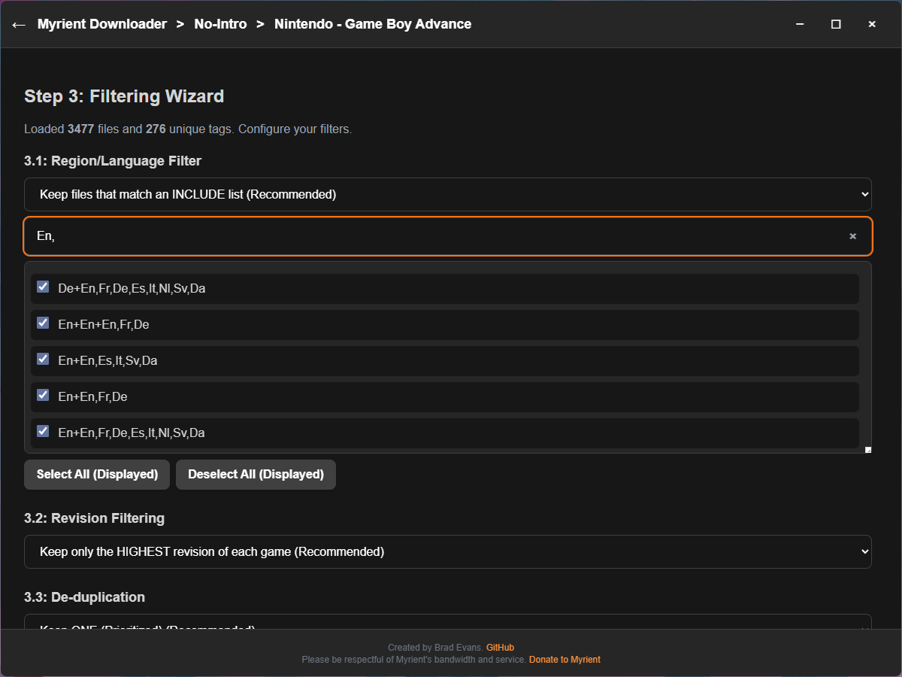
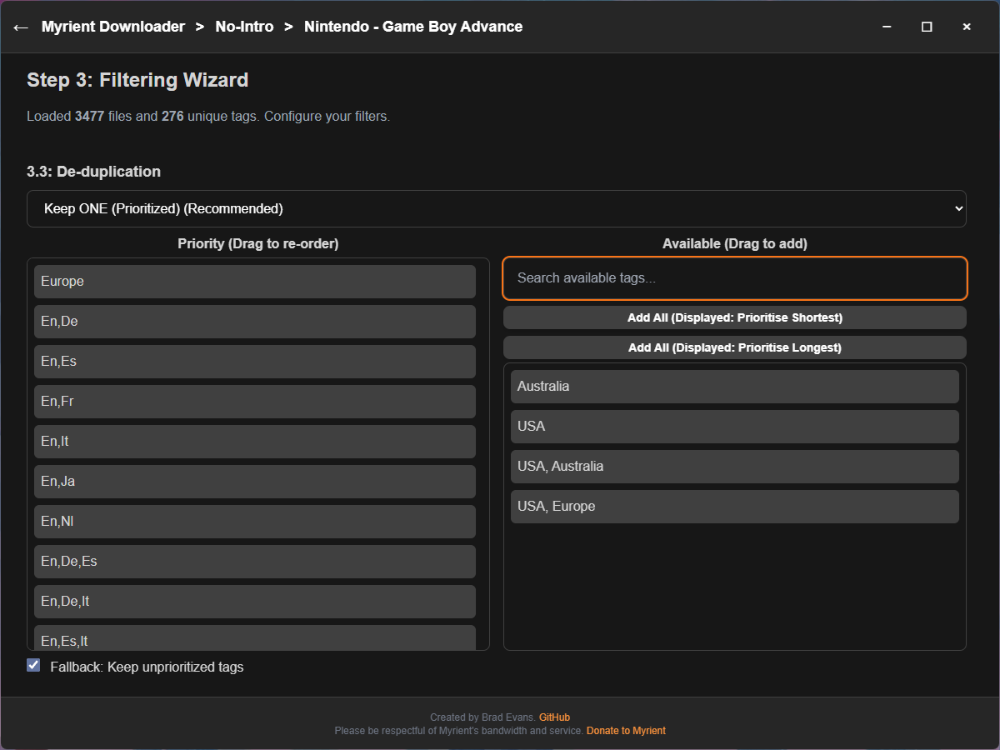
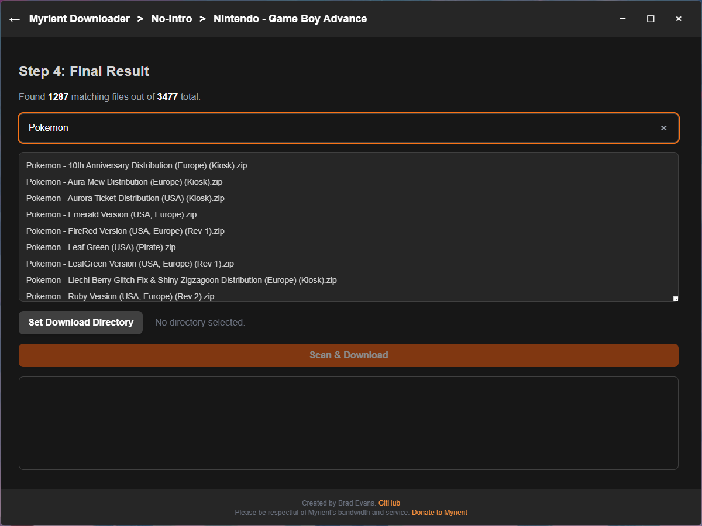
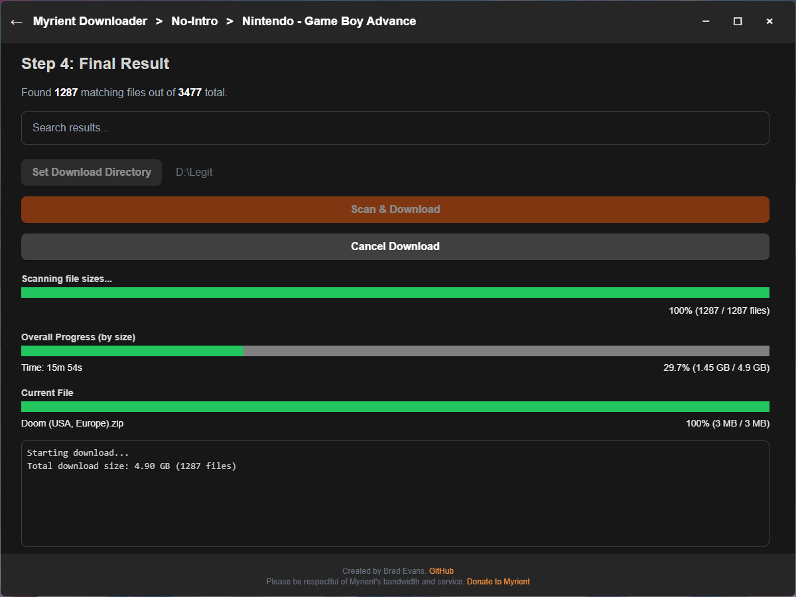

# Myrient Downloader


A powerful, standalone desktop application designed to provide a secure and efficient interface for accessing, filtering, and downloading public domain game archives from the [Myrient](https://myrient.erista.me/) library.

Download the latest release here:

[](https://github.com/bradrevans/myrient-downloader/releases)

Please consider donating to support my work and Myrient's service.

<a href="https://ko-fi.com/bradrevans"></a>

<a href="https://myrient.erista.me/donate/"></a>

***

## What the Application Does


The Myrient Downloader provides a seamless **four-step process** for creating curated game collections:
1.  **Browse and Select:** Allows users to easily browse and search the entire Myrient catalog of archives (e.g., No-Intro, MAME) and drill down into specific systems or categories.


2.  **Filter and Curate:** Presents a powerful wizard to filter thousands of files down to a specific list based on custom rules:
    * **Exclude/Include Tags:** Filter files by region or language tag (e.g., keep only `(USA)`).
    * **Revision Control:** Automatically select only the single highest revision of every game title.
    * **Priority De-duplication:** Allows the user to build a priority list of tags to select the *best* version when multiple unique copies of a game exist.





3.  **Download:** Executes the download of the final, filtered list of files.
4.  **Manage Progress:** Displays a live overall size-based progress bar with an **accurate time remaining estimate**. It handles file skipping for existing archives and provides a safe cancellation feature that prompts the user to delete any incomplete file.
    * **Smart Resuming:** The application **scans for existing local files** and automatically resumes the overall progress bar from the point it left off. Files that are fully downloaded are skipped, ensuring efficient use of bandwidth.




***

## Requirements & Installation (Source Code)

**This section is for developers or users who want to run the application from the source code (instead of downloading a pre-compiled executable), or build their own executable (sorry I only have a Windows machine).**

1.  **Clone/Download:** Get all the files from this repository.

2.  **Install Dependencies:** Open a terminal in the project's root folder (where `package.json` is) and run:

    ```bash
    npm install
    ```

3.  **Run the App (Development Mode):**

    ```bash
    npm start
    ```

***

## Building Standalone Executables

The project is configured with `electron-builder` to generate ready-to-run executables for major operating systems.

### Build Commands

| Target OS | Command | Output |
| :--- | :--- | :--- |
| **Windows** | `npm run build:win` | Portable `.exe` |
| **macOS** | `npm run build:mac` | `.dmg` |
| **Linux** | `npm run build:linux` | `.AppImage` |
| **Current OS (All)** | `npm run build:all` | Target for the current OS |

## Disclaimer

This is a web-scraping tool. Please be respectful of [Myrient's](https://myrient.erista.me/) bandwidth and service. This tool would not exist if it wasn't for them.
