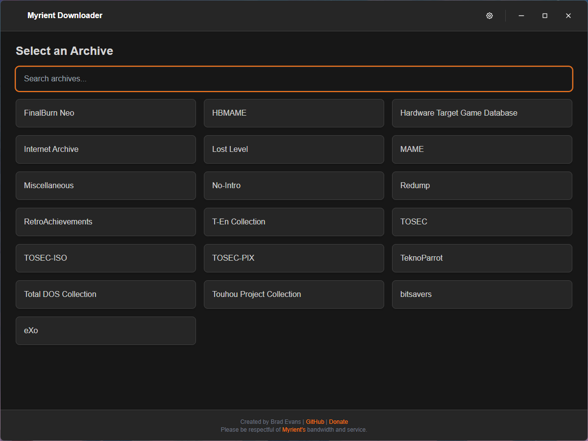
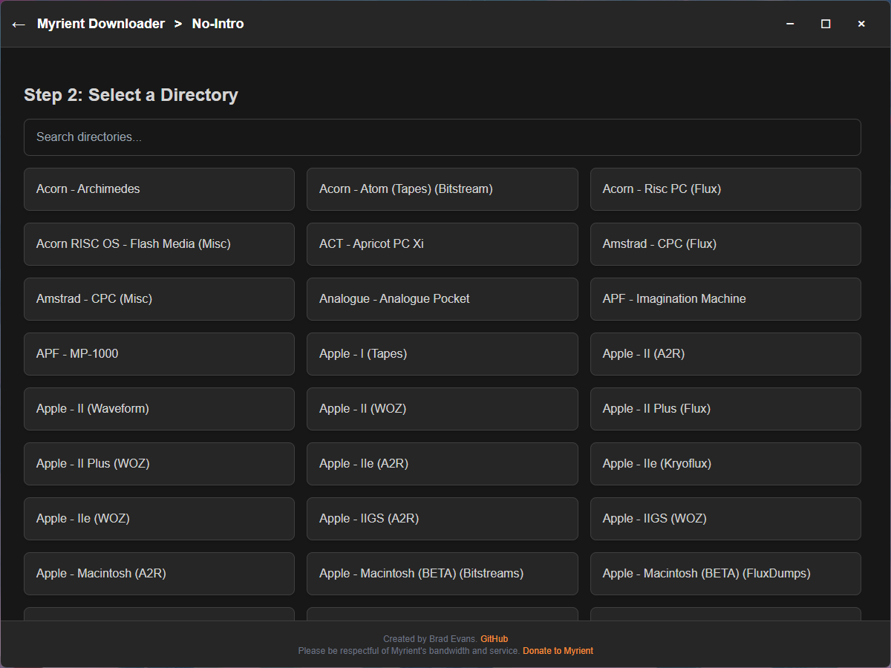
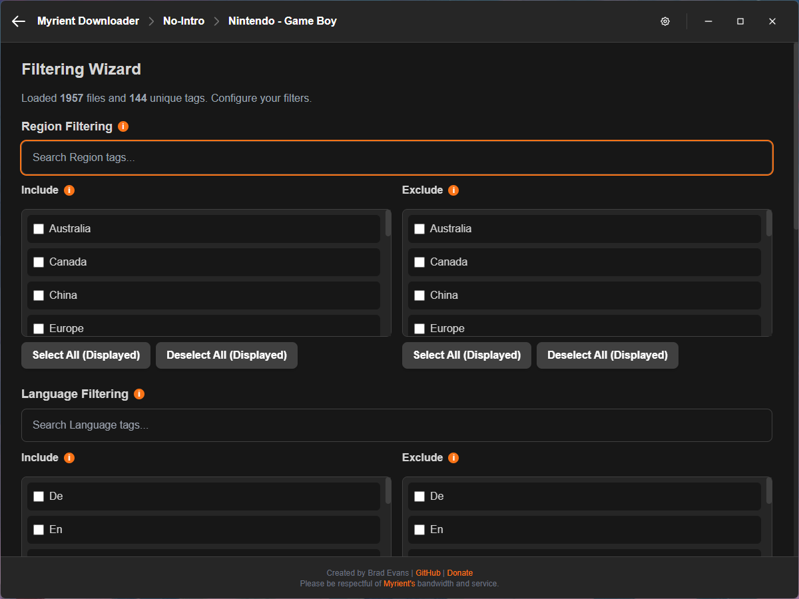
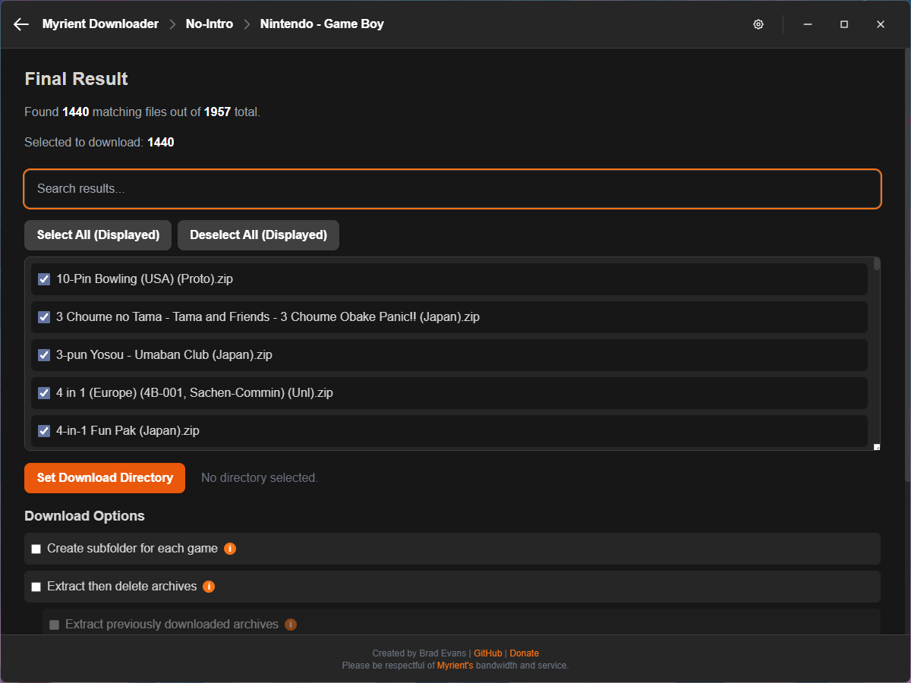
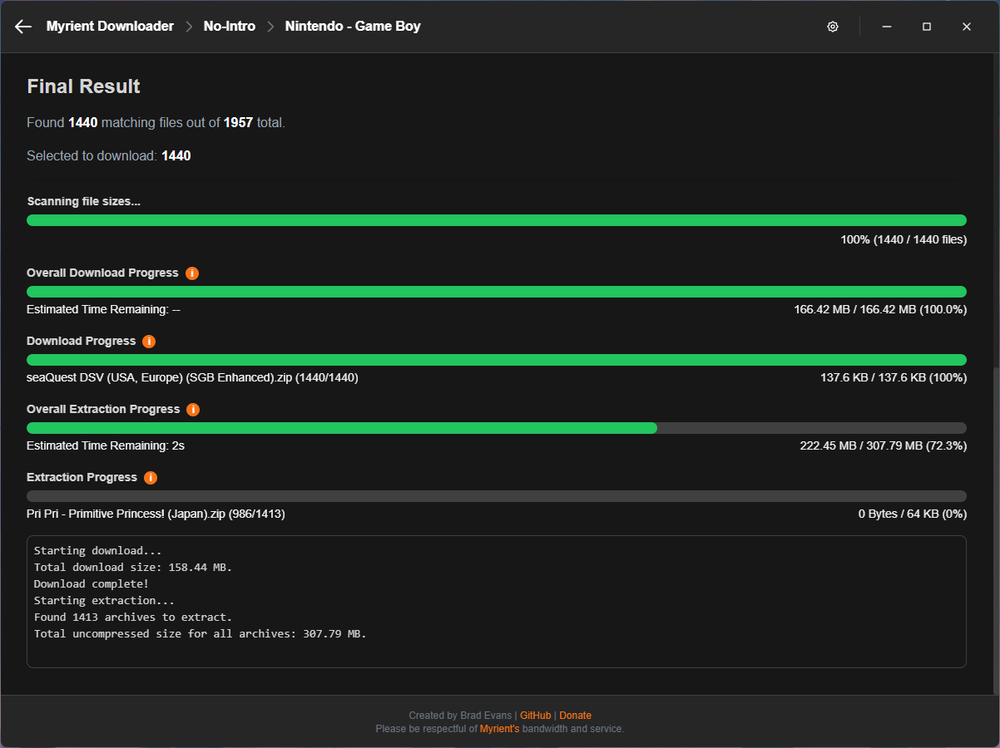
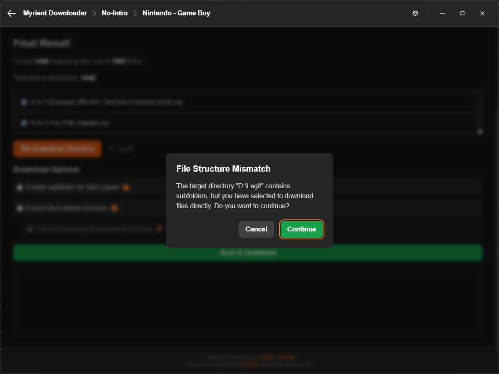
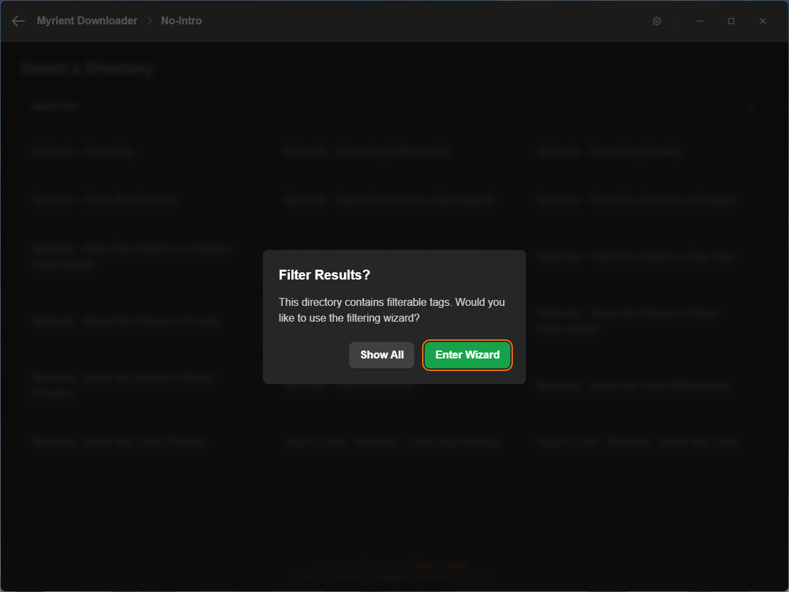
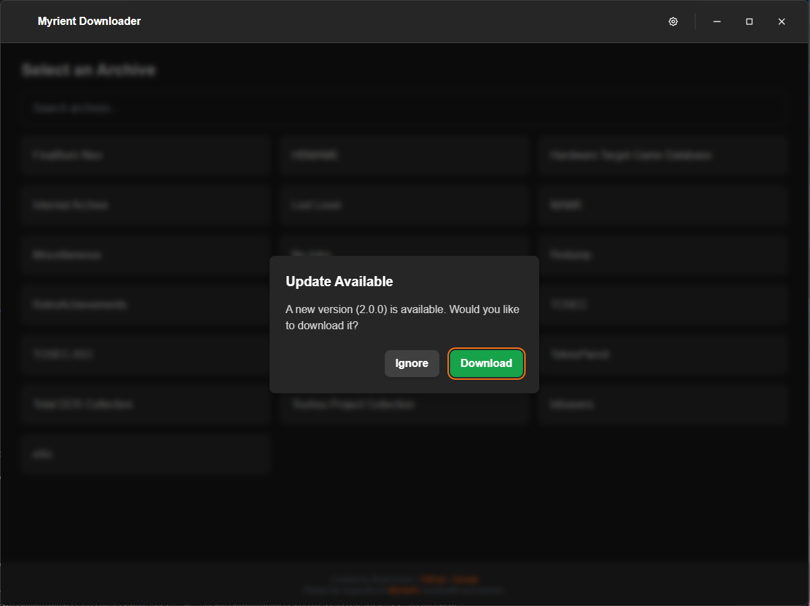
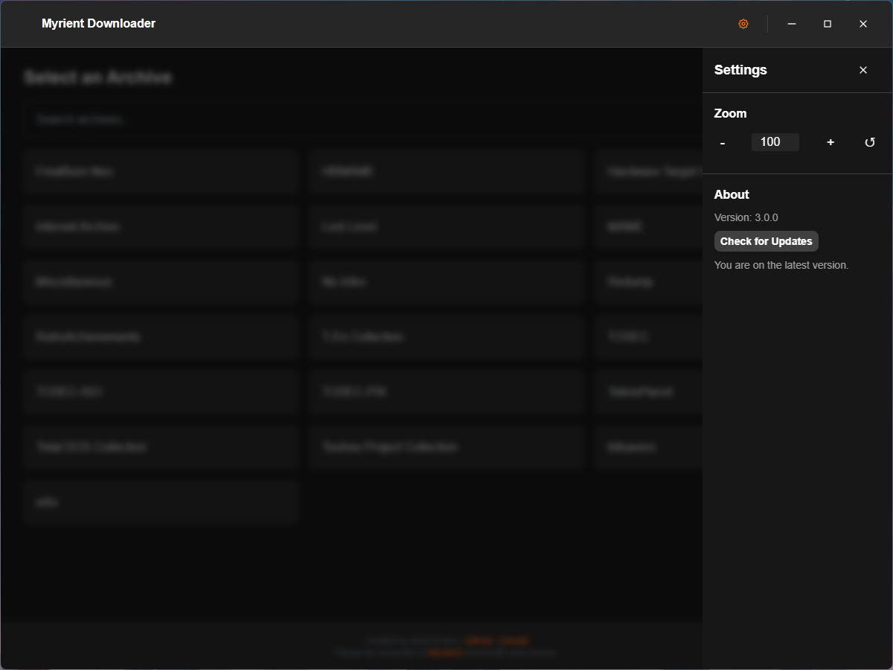

# Myrient Downloader


A powerful, standalone desktop application designed to provide a secure and efficient interface for accessing, filtering, and downloading public domain game archives from the [Myrient](https://myrient.erista.me/) library.

Download the latest release here:

[](https://github.com/bradrevans/myrient-downloader/releases)

*You will need to clone the repository and build the application yourself using the instructions in this README if you want to run the application on a Mac.*

Please consider donating to support my work and Myrient's service.

<a href="https://ko-fi.com/bradrevans"></a>

<a href="https://myrient.erista.me/donate/"></a>

***

## What the Application Does

The Myrient Downloader provides a seamless process for creating curated game collections:
1.  **Browse and Select:** Allows users to easily browse and search the entire Myrient catalog of archives (e.g., No-Intro, MAME) and drill down into specific systems or categories.
2.  **Optionally Filter and Curate:** Presents a powerful wizard to filter thousands of files down to a specific list based on custom rules:
    * **Exclude/Include Tags:** Filter files by region or language tag (e.g., keep only `(USA)`).
    * **Revision Control:** Automatically select only the single highest revision of every game title.
    * **Multi-Disc/Cart:** Automatically download all discs or cartridges for a given title.
    * **Priority De-duplication:** Allows the user to build a priority list of tags to select the *best* version when multiple unique copies of a game exist.
    * **Skip The Filtering:** Don't need to filter? Go ahead and skip it! Archives that don't support tags will skip the filtering automatically.
3.  **Download:** Executes the download of the final, filtered list of files.
    * **Include/Exclude Individual Titles:** Toggle download for titles on and off individually.
    * **Directory Management:** Automatically create sub directories for every title. If you target a directory with a conflicting folder structure you will be warned before continuing.
    * **Extract Archives:** Automatically extract files and delete the original archives. It will even do this for things you previously downloaded.
4.  **Manage Progress:** Displays a live overall size-based progress bar with an **accurate time remaining estimate**. It handles file skipping for existing archives and provides a safe cancellation will delete incomplete files.
    * **Smart Resuming:** The application **scans for existing local files** and automatically resumes the download from the point it left off. Files that are fully downloaded are skipped, ensuring efficient use of bandwidth. This also works for extraction.
5. **Quality of Life:** A variety of features and visual queues help you to use the application.
   * **Tooltips:** Helpful informative tooltips are scattered across the UI to help explain how things work.
   * **Update Notification:** Get notified when a new version is available for download.
   * **Settings Menu:** A settings menu lets you check for updates and adjust application zoom levels for better support across a variety of displays.
   * **Keyboard Navigation:** Using your arrow keys and enter you can navigate many of the UI elements quickly and efficiently.

*And much, much more...*
  
***

## Screenshots

*Select your archive.*


*Select your directory.*


*Include/exclude tags.*


*Set your filtering preferences and prioritise your tags.*


*Select your titles.*


*Configure your download options and monitor progress.*


*Warnings when target directories differ from your desired folder structure.*


*Optionally, skip filtering all together if you're after something specific.*


*Get notified when a new version is available.*


*Check for updates or adjust zoom levels.*

***

## Requirements & Installation (Source Code)

**This section is for developers or users who want to run the application from the source code (instead of downloading a pre-compiled executable), or build their own executable.**

1.  **Clone/Download:** Get all the files from this repository.

2.  **Install Dependencies:** Open a terminal in the project's root folder (where `package.json` is) and run:

    ```bash
    npm install
    ```

3.  **Run the App (Development Mode):**

    ```bash
    npm start
    ```

***

## Building Standalone Executables

The project is configured with `electron-builder` to generate ready-to-run executables for major operating systems.

### Build Commands

| Target OS | Command | Output |
| :--- | :--- | :--- |
| **Windows** | `npm run build:win` | Portable `.exe` |
| **macOS** | `npm run build:mac` | `.dmg` |
| **Linux** | `npm run build:linux` | `.AppImage` |
| **Current OS (All)** | `npm run build:all` | Target for the current OS |

## Disclaimer

This is a web-scraping tool. Please be respectful of [Myrient's](https://myrient.erista.me/) bandwidth and service. This tool would not exist if it wasn't for them.
